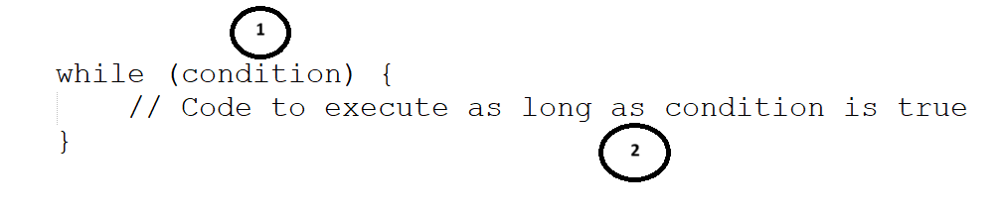

# [Control Flow](#control-flow)
**Control flow** in C++ refers to how the computer follows the instructions in a program, step by step. To make it easier to understand, we can look at it through three main parts: **Sequence**, **Iteration**, and **Selection**.<br>

**Sequence** is the basic flow where the computer executes instructions one after another in the exact order they appear, like following a list from top to bottom.<br>

**Iteration** allows the computer to repeat a set of instructions multiple times. This is useful when we want to perform the same task repeatedly, such as looping through a list or running a process until a condition is met.<br>

**Selection** involves making decisions. The computer chooses between different paths based on certain conditions, like deciding which action to take depending on whether something is true or false.<br>
<br>
<br>

## 1. [Sequence](#1-sequence)
To get desired output if you want to apply some steps in sequential format then we have to use Sequence. In this case the flow of our sequence is important to get desired output.<br>


Example 1.1,<br>
Write a program which is used to print name, address & mobile no of a person.

```
int main()
{
    printf("Shubhankar Ingale");
    printf("Pune");
    printf("7777777777");
    return 0;
}
```

In above program we have to print three different things on screen due to which we have to use concept of **sequence**.<br>
<br>


Example 1.2,<br>
Write a program which is used to print character `A` 4 times on console screen.

```
int main()
{
    printf("A");
    printf("A");
    printf("A");
    printf("A");
    return 0;
}
```

In above program we are using concept of **sequence**, We can replace it into Iterator, we can see that in further Example 2.2.<br>


Example 1.3,<br>
Write a program which is used to print character `A` to `Z`  on console screen.

```
int main()
{
    printf("A");
    printf("B");
    printf("D");
    printf("E");
    :
    :
    printf("Z");
    return 0;
}
```

In above program we are using concept of **sequence**, We can replace it into **iterator**, we can see that in further Example 2.3.
<br>

Example 1.4,<br>
Write a program which is used to print even no from 2 to 12 by using the concept of sequence.

```
int main()
{
    printf("2");
    printf("4");
    printf("6");
    printf("8");
    printf("10");
    printf("12");
    return 0;
}
```

In above program we are using concept of **sequence**, We can replace it into **iteration** & **selection**, we can see that in further [Example 3.1](https://github.com/ingaleshubhankar/CPP-HANDBOOK/blob/main/Basics%20of%20programming/ControlFlow.md#3-selection).<br>
<br>


## 2. [Iteration](#2-iteration)
If you want to apply/perform in the repeated manner then we have to use iteration. To apply the concept of iteration we have to use loops.
Every iteration may contains Sequence, Selection or Iteration.<br>

### [for loop](#for-loop)
The for loop in C++ is a control structure that allows code to be executed repeatedly based on a given condition. It is particularly useful when the number of iterations is known before entering the loop. 

| For Loop Syntax  |
|:--------------:|
|  |
<br>

Explaination:-<br>

 1) At this point we can intialize loop counter either we can initialize zero loop couter or multiple loop counter.<br>

 2) At this place we have to wtite the condition at this place used to terminate our loop. It can be zero contains or multiple conditions, which are combined with logical operator like (&&, ||).

 3) At this place we can write modification code used to change value of loop counter. we can write increment or decrement conditions multiple times.

4) At this place we can write actual loop body which gets executed multiple times. inside loop body we can use **Sequence**, **Selection** or **Iteration**.
<br>

### [while](#for-loop)
A while loop is used to repeatedly execute a block of code as long as a specified condition is true. Here's a simple breakdown of how it works: 

| while loop Syntax  |
|:--------------:|
|  |
<br>

Explaination:-<br>

 1) `condition`: This is a Boolean expression. The loop will keep running as long as this condition evaluates to true.<br>

 2) `Body`: The block of code inside the curly braces {} is the body of the loop, which is executed repeatedly.<br>

 3) Explaination:
    - First, the condition is evaluated
    - If the condition is true, the code inside the loop's body is executed.
    - After executing the body, the program goes back to evaluate the condition again.
    - This process repeats until the condition becomes false.
    - When the condition becomes false, the loop terminates, and the program continues with the code after the loop.
<br>
<br>

Example 2.1,<br>
Write a program which is used to print no from 1 to 10 by using function.

```
int main()
{
    int i=0;
    for(i=1;i<=10;i++)
    {
        printf("%d",i);
    }
    return 0;
}
```

In Above program we are using concept of **Iteration** with the help of for loop here.<br>
<br>


Example 2.2,<br>
Write a program which is used to print 4 times `A` by using for loop.

```
int main()
{
    int i=0;
    for(i=0;i<=3;i++)
    {
        printf("A");
    }
    return 0;
}
```

In Above program we are using concept of **Iteration** with the help of for loop here to print `A` 4 times.<br>


Example 2.3,<br>
Write a program which is used to print 4 times `A` by using for loop.

```
int main() 
{
    for (int i = 65; i <= 90; i++) {
        printf("%c ", i);
    }
    printf("\n");
    return 0;
}
```

In Above program we are using concept of **Iteration** with the help of for loop here to print `A` to `Z`.<br>


## 3. [Selection](#3-selection)
If there are multiple possibilities to select any solution then we have to se concept of Selection. In case of selection, we have to use switch program construct or if-else-if construct.<br>

Example 3.1,<br>
Write a program which is used to print even no from 2 to 12 by using function.

```
int main()
{
    int i=2;
    for(i=2;i<=12;i++)
    {
        if(i%2==0) {
            printf("%d",i);
        }
    }
    return 0;
}
```

In Above program we are using concept of **Iteration** & **Selection** here.


Example 3.2,<br>
Write a program which is used to print even no from 2 to 12 by using function.

```
int main()
{
    int i=2;
    while(i!=12)
    {
        printf("%d",i);
        i+=2;
    }
    return 0;
}
```

In Above program we are using concept of **Iteration** & **Selection** here. We are using while loop here to print .