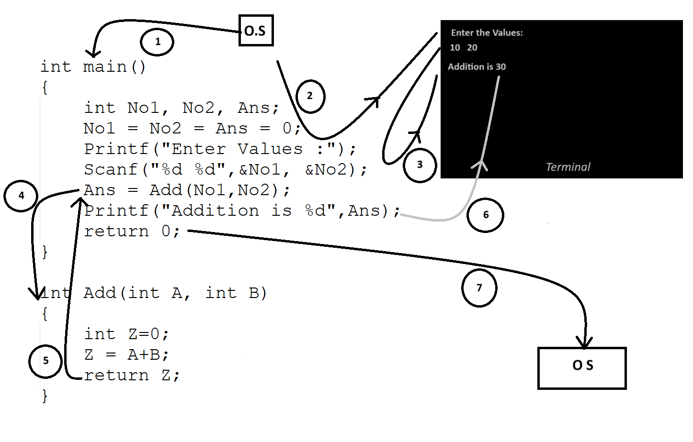

# Program - Demonstration of Execution Flow
In this section we are going to understand the basic execution flow of program when you run a basic program and which contains function call. We are going to understand the same by following the below Image<br>



<br>

## Steps:

1. As program execution control flow moved from OS to Addition.cpp program & Program starts execution: The main() function is called.

2. Memory allocation: Three integer variables (No1, No2, Ans) are created and initialized to 0.
User prompt: The program prints:
```cpp
Enter Values: 
```

3. User input: The user enters two integer values, which are stored in No1 and No2.

4. Function call: The Add(No1, No2) function is called, passing the input values as arguments.

5. Function execution: Inside Add(int A, int B), two variables (A and B) hold the passed values.
Addition operation: A new integer variable Z is created and assigned the sum A + B.
Return value: The function Add() returns Z (which is the sum) back to main().
Result storage: The returned value is stored in Ans.

6. Output result: The program prints:
```cpp
Addition is 30
```

7. Return the flow of the program back to the OS from this cpp program.

