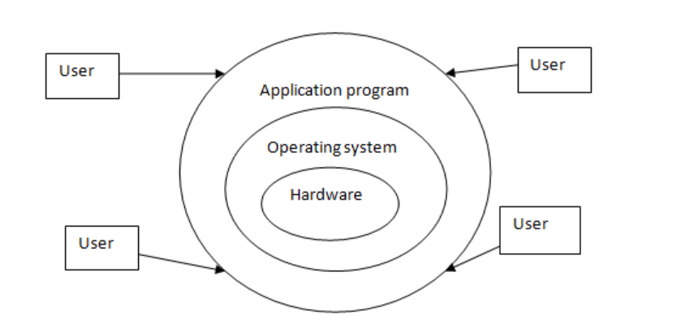
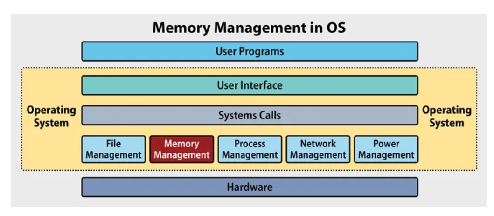
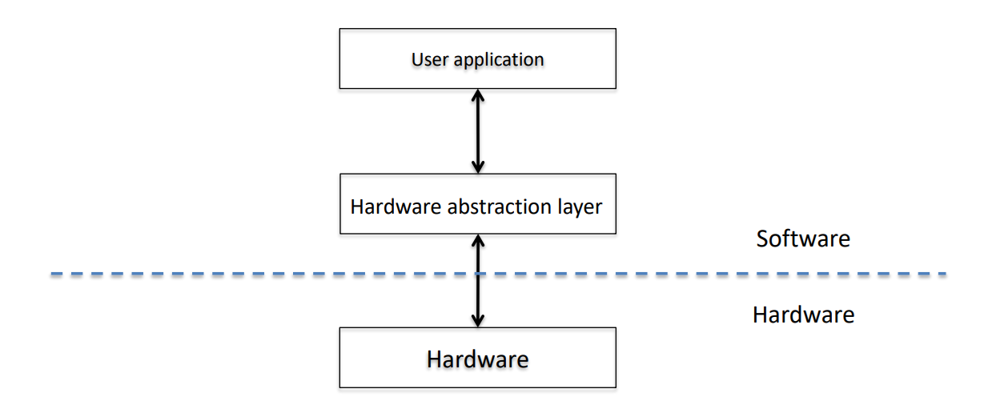
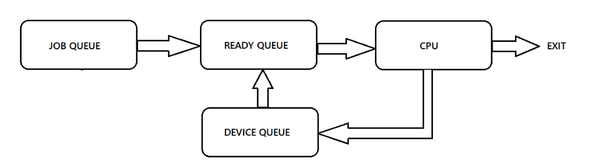

# [Operating System Basics](#Operating-System-Basics)
It is a set of programs that act as a interface between a user of a computer and the computer hardware
 
 

## [Operating system task](#operating-system-task)
 ✓ **File Management**: 
&nbsp;&nbsp;&nbsp;&nbsp;It used to maintain information about the files and allows used to create file, read contents of file, write contents in file etc.
 

 
 

 ✓ **Process Management**: 
&nbsp;&nbsp;&nbsp;&nbsp;A program does nothing unless its instructions are executed by CPU. A process is defined as program in execution or running instance of program. 
Process management part of operating system is responsible for creating and ternating process, provides mechanism for process synchoronization, suspending and resuming the process, maintaining context of a process etc.
 

 
 

 ✓ **Memory Management**: 
&nbsp;&nbsp;&nbsp;&nbsp;This part of OS is responsible for allowing user to allocate memory, deallocate memory and maintaining the record of allocated and unallocated memory.
 

 
 

 ✓ **Hardware abstraction**: 
&nbsp;&nbsp;&nbsp;&nbsp;It means hiding the internal complexity of hardware from user. This is most important task of operating system.
 

 
 

 ✓ **CPU Scheduling**: 
&nbsp;&nbsp;&nbsp;&nbsp;Schedule a particular task from set of multiple task and assign this task to CPU is a responsiblility of CPU scheduler.
 

 
 

---