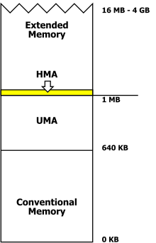

# [Real Mode and Protected Mode](#real-mode-protected-mode)

## [Real Mode](#real-mode)
 ✓ Real mode is an operating mode of all x86-compatible CPUs. 
 ✓ Real mode is characterized by a 20-bit segemented memory address space. 
 ✓ In this mode only 20 address lines are accessible, due to which operating system access only 2^20 i.e. MiB memory is accessible. 
 ✓ Real mode provides no support for memory protection, multitasking, or code privieges levels. 
 ✓ Before the release of the 80286, which introduced protection mode, real mode was the only available mode for the X86 CPUs. 
 ✓ In the interests of backwards compatibility, all X86 CPUs start in real mode when reset.
 
 

 ✓ In real mode operating system is single tasking means it can perfrom only single task at a time. 
✓ Every operating system first boot in real mode then enters into the protected mode. 
✓ To enter into the protected mode it require to open A20(Address line 20) gate. 
✓ When the A20 gate opens all the address lines are accessible. If the address bus is of 32 bits then it has range from A0 to A31. 
✓ If operating system is real mode operating system then it uses only first 640 kb part of RAM. 
✓ If a process wants more memory than the 640kb then OS takes some part of memory after 640kb in temporary purpose then this type of memory management is cakked as exoanded memeory scheme. 
 

## [Protected Mode](#protected-mode)
 ✓ Protected mode is an operational mode of X86-compatible CPU. 
 ✓ It allows system software to use features such as virtual memory, paging and safe multitasking designed to increase an operating system's control over application software. 
 ✓ When a processor that supports X86 protected mode is powered on, it begins executing instructions in real mode, in order to maintain backwards compatibility whith earlier X86 processors.
  
 ✓ Protected mode may only be entered after the system software sets up several descriptor tables and enables the Protection Enable (PE) bit in the control register 0 (CR0).
 
 ✓ Protected mode was first added to the X86 architecture in 1982, with the release of Intel's 80286(286) processor, and later extended with the release of the 80386 (386) in 1985.
 

