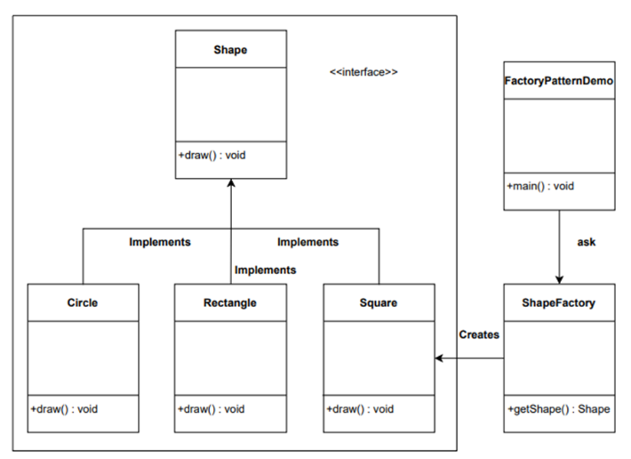

# [Creational Patterns](#creational-patterns)
This design pattern provides way of creating the objects while hiding creation logic. rather than than instatiating object directly using new operator.<br>

This gives flexibility to program, which object needs to create.

## 1) Singleton
The Singleton Pattern is a creational design pattern that ensures a class has only one instance and provides a global point of access to that instance. It is widely used in software development where only a single instance of a class is required throughout the application's lifecycle.<br>


|   Singleton    |
|:--------------:|
|  |
<br>

Some components on our system only need to have single Instance.<br>

For ex,
Database Class Object. The DB that loads up from its constructor into program & gives info. Once it is loaded, you dont really want more than one object.

Points to be note for making a Singleton Class,
 - Private Constructor.
 - Delete Copy Constructor & Copy Assignment Operator.
 - Static Object Creation & Static method Access.

### Example,

```
#include<iostream>
#include<cstdlib>
#include<time.h>

using namespace std;

class Random
{
    private:
        Random() {
            srand(time(NULL));
        }
    
    public:
        Random(Random& ref) = delete;
        Random& operator = (Random& ref) = delete;
        int getRandomNo(int limit=7)
        {
            int no=rand();
            no = no % limit;
            return no;
        }

        static Random& getInstance()
        {
            static Random instance;
            return instance;
        }
}; //class closed


int main()
{
    int RNo=Random::getInstance().getRandomNo();
    cout<<"Random Number :"<<RNo<<endl;
    return 0;
}

```

The above class & design is good and Idea example of Singleton Design Pattern, No problem till it face any dependency problem between Client and Service Implementation.<br>


## 2) Factory
The Factory Pattern is a creational design pattern that provides an interface for creating objects but lets subclasses decide which class to instantiate. Instead of calling a constructor directly, the factory method returns an instance of the appropriate class.

It is widely used in applications where object creation logic is complex and should be centralized for better maintainability.<br>

| Factory Pattern |
|:--------------:|
|  |
<br>

Factory pattern is type of creational designing pattern, which deals with object creation mechanism.<br>

In CPP we an achive basic factory pattern by "Creating object using seperate method & polymorphic class"

### Abstract Factory:-
abstract factory is useful in situation that requires creation of different types of object. all are derived from common base type.<br>

Abstract factory defines method for creating object, which subclass can override to specify detived type that will be create. thus at run time appropriate method will be called depend on which type of object get pointed.<br>

Factory pattern, it creates object for you rather you intiating object directly. It also known as **"Virtual Constructor"**.<br>

C++ does not have virtual constructor because in order to call virtual function you require object.<br>


